# Linear open workstream — skin-cli

**Last updated:** 2026-05-22  
**Issue:** [STO-141](https://linear.app/stockwise-productions-prototypes/issue/STO-141) — Add auth + idempotency tests for skin-cli package  
**Related:** [skin-cli#1](https://github.com/bstockwelldev/skin-cli/pull/1) (Step 3 CLI scaffold)

---

## Workstream diagram

```mermaid
flowchart TD
  classDef backlog fill:#1e293b,stroke:#94a3b8

  PR["PR #1 Step 3 skin CLI package"]
  S141["STO-141 auth + idempotency tests"]:::backlog

  PR --> S141

  T1["? Auth: tokens never in stdout/logs/errors"]
  T2["? Invalid skin JSON fails fast"]
  T3["? Idempotent re-run — no duplicate side effects"]
  T4["? Permission gate on protected endpoints"]

  S141 --> T1
  S141 --> T2
  S141 --> T3
  S141 --> T4

  T1 --> CI["CI: vitest on PR"]
  T2 --> CI
  T3 --> CI
  T4 --> CI
  CI --> DONE["Close STO-141"]
```

---

## Execution order

| Step | Work | Acceptance |
|------:|------|------------|
| 1 | Add `tests/` (or extend existing) for auth redaction | No token leakage on failure paths |
| 2 | Malformed config fixture | Clear error; no partial write |
| 3 | Double-invoke same CLI args | Identical output; no orphaned temp files |
| 4 | Non-admin token against protected API | Explicit auth error |
| 5 | Wire **CI** (`.github/workflows/ci.yml`) | All cases green on PR |

---

## Repo layout (reference)

| Path | Role |
|------|------|
| `src/commands.ts` | CLI commands |
| `src/core.ts` | Core apply logic |
| `tests/cli.test.ts` | Existing test entry |
| `vitest.config.ts` | Test runner |

No Linear project slug; track under team **Stockwise-productions-prototypes**.
